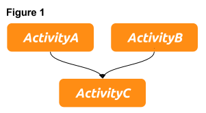
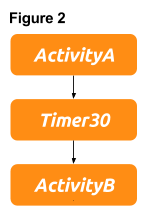
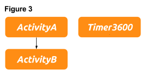

[](https://travis-ci.com/babbel/floto)

# floto
floto is a task orchestration tool based on AWS SWF (Simple Workflow Service) written in Python. It uses Python 3 and boto3, the AWS SDK for Python.

<!-- START doctoc generated TOC please keep comment here to allow auto update -->
<!-- DON'T EDIT THIS SECTION, INSTEAD RE-RUN doctoc TO UPDATE -->
**Table of Contents**

- [Introduction](#introduction)
- [Defining the Workflow's Logics](#defining-the-workflows-logics)
  - [Tasks](#tasks)
    - [Activity Task](#activity-task)
    - [Generator](#generator)
    - [ChildWorkflow](#childworkflow)
    - [Timer](#timer)
    - [Retry Strategy](#retry-strategy)
- [Decider](#decider)
  - [Dynamic Decider](#dynamic-decider)
  - [Decider Daemon](#decider-daemon)
  - [JSON Representation of Decider Specifications](#json-representation-of-decider-specifications)
- [Activities](#activities)
  - [Activity](#activity)
  - [Generator](#generator-1)
  - [Activity Context](#activity-context)
  - [Activity Result](#activity-result)
- [Activity Worker](#activity-worker)
  - [Activity Worker Heartbeats](#activity-worker-heartbeats)
- [floto's simple SWF API](#flotos-simple-swf-api)
  - [Interface to SWF](#interface-to-swf)
  - [Start the Workflow](#start-the-workflow)
  - [Register Domains, Workflow Type and Activity Type](#register-domains-workflow-type-and-activity-type)

<!-- END doctoc generated TOC please keep comment here to allow auto update -->
## Introduction
The <a href="https://aws.amazon.com/swf/" target="_blank">AWS Simple Workflow Service</a> allows to 
manage distributed applications in a scalable, resilient and fault tolerant way.
It minimizes the complexity by decoupling the execution logic from the application worker. The 
Deciders, which handle the execution logic and the worker are stateless and therefore fault 
tolerant. Whenever something goes wrong the Deciders and worker can be restarted and pick up their 
work where they left off. Furthermore several Deciders and worker of the same kind can be run at 
the same time without interference of the workflow execution or result which again leads to 
higher resilience and scalability. Every step of a workflow execution is recorded by SWF and the 
history of events is provided to the Deciders when they are about to schedule tasks.

The process of implementing a SWF workflow can be somewhat tedious if you want to e.g. 
handle complex execution logic and treat task failures and time-outs.
floto solves this problem by providing a Python package which allows you to easily define the 
execution logic and activity worker.
For the impatient we provide a ["Getting started example"](examples/hello_world.py) of a
simple workflow.
The example shows the definition of a simple workflow with a single task. The task is defined and passed to the Decider. Furthermore an activity is defined so that the worker is able to executes the activity function on request. The Decider and the worker are started and the workflow execution is initiated. The single steps to define the components necessary to execute a workflow are discussed in more detail in the next sections.

## Defining the Workflow's Logics
The business logic of your distributed application is handled by so called Deciders. Deciders act on events like workflow start, task completion or task failure and schedule tasks that are to be executed. The logic itself is defined by a list of tasks. The tasks are then [passed to the decider](#decider).
Let's get started with a simple example of three activities as depicted in figure 1.  In this example ``ActivityA`` and ``ActivityB`` are scheduled after the workflow start. ``ActivityC`` is executed once they are completed.



The definition of the activity tasks:
```python
from floto.specs.task import ActivityTask

activity_task_a = ActivityTask(name='ActivityA', version='v1')
activity_task_b = ActivityTask(name='ActivityB', version='v1')
activity_task_c = ActivityTask(name='ActivityC', version='v1', requires=[activity_task_a, activity_task_b])
```
floto provides different kinds of tasks which can be used to define the workflow logic. In the aforementioned example objects of type ``ActivityTask`` have been used. Furthermore there are Timer, ChildWorkflow and Generator tasks which are described in the following sections.
### Tasks
The tasks are the building blocks of the execution logic. All tasks implement the ``floto.specs.task.Task`` interface, which has the fields ``id_`` and ``requires``. The id of task must be unique on the workflow level. For ``Timer`` objects it has to be set explicitly. For the other tasks there is a default value which is derived by the object's properties, however it can be set explicitly. This is described in the corresponding sections. Dependencies of the tasks are defined by a list of required tasks. 
#### Activity Task
Activity tasks are tasks which trigger the execution of activity function by the Decider. ``ActivityTask`` objects have the following properties:

| Parameter | Type | Description |
| :---         | :---           | :---          |
| ``name`` [Required]   | ``str``        | The name of the activity. Corresponds to the name of the activity as defined by the [worker](#activity-worker).   |
| ``version`` [Required]   | ``str``        | The version of the activity. Corresponds to the version of the activity as defined by the [worker](#activity-worker).    |
| ``activity_id``   | ``str``        | The unique id of the task. Defaults to ``<name:version:hash_id>``. The ``hash_id`` is derived depending on the input and required tasks.    |
| ``requires``   | ``list``        | List of ``floto.specs.task.Task`` objects, which defines the dependencies.    |
| ``input``   | ``str``, ``obj``        | The input provided by the task definition. If an object is provided it must be JSON serializable, e.g. of type dict or list. For more information on inputs see section [Activity Context](#activity-context).    |
| ``retry_strategy``   | ``floto.specs.retry_strategy.Strategy``        | The retry strategy which defines the behavior in case of task failure. See section [Retry Strategy](#retry-strategy)    |
| ``task_list``   | ``str``        | The task list which is used when the task is scheduled. If not set the default activity task list of the decider is used.    |

#### Generator
``floto.specs.task.Generator`` inherits from ``ActivityTask`` and implements the same interface. Generators are activities which spawn tasks that are subsequently included in the execution logic. More on generators in section [Generator](#generators). 
To see how generators work see the ``examples/s3_file_string_length`` example.
#### ChildWorkflow
Deciders can start child workflows during execution. See example ``examples/child_workflow``. The following table gives an overview over the child workflow task parameters:

| Parameter | Type | Description |
| :---         | :---           | :---          |
| ``workflow_type_name`` [Required]   | ``str``        | The name of the workflow type.   |
| ``workflow_type_version`` [Required]   | ``str``        | The version of the workflow type.    |
| ``workflow_id``   | ``str``        | The unique id of the task. Defaults to ``<workflow_type_name:workflow_type_version:hash_id>``. The ``hash_id`` is derived depending on the input and required tasks.    |
| ``requires``   | ``list``        | List of ``floto.specs.task.Task`` objects, which defines the dependencies.    |
| ``input``   | ``str``, ``obj``        | The input provided by the task definition. If an object is provided it must be JSON serializable, e.g. of type dict or list. For more information on inputs see section [Activity Context](#activity-context).    |
| ``retry_strategy``   | ``floto.specs.retry_strategy.Strategy``        | The retry strategy which defines the behavior in case of task failure. See section [Retry Strategy](#retry-strategy)    |
| ``task_list``   | ``str``        | The decider task list of the child workflow.    |

#### Timer
Timers are used to define time-outs. Time-outs can be used inside the execution graph to delay the execution of a subsequent task (figure 2). Secondly they can be used as independent task in order to delay the execution of a subsequent workflow execution (figure 3).

Example task definitions for the delayed execution of ``ActivityB``:



```python
activity_task_a = ActivityTask(name='ActivityA', version='v1')
timer_30        = Timer(id_='Timer30', delay_in_seconds=30, requires=[activity_task_a])
activity_task_b = ActivityTask(name='ActivityB', version='v1', requires=[timer_30])
```

Example task definitions for a "repeated workflow execution" delay. In this case the workflow does not complete before the ``timer_3600`` times out after one hour.



```python
activity_task_a = ActivityTask(name='ActivityA', version='v1')
activity_task_b = ActivityTask(name='ActivityB', version='v1', requires=[activity_task_a])
timer_3600      = Timer(id_='Timer3600', delay_in_seconds=3600)
```
#### Retry Strategy
Sometimes activities fail or time out. A retry strategy can be defined for ``ActivityTask``, ``Generator`` and ``ChildWorkflow`` objects. In case a strategy is defined, the task is rescheduled after an execution failure. The following example shows a task definition which reschedules the task three times before the workflow fails.

```python
from floto.specs.retry_strategy import InstantRetry

retry_strategy = InstantRetry(retries=3)
activity_task = ActivityTask(name='ActivityA', version='v1', retry_strategy=retry_strategy)
```
## Decider
Deciders are the parts of your application which orchestrate the workflow execution. They are defined by means of Decider specifications:

```python
from floto.specs import DeciderSpec
from floto.decider import Decider

decider_spec = DeciderSpec(domain='your_domain',
                           task_list='your_decider_task_list',
                           default_activity_task_list='your_activity_task_list',
                           activity_tasks=[activity_task_a, activity_task_b, activity_task_c])

Decider(decider_spec=decider_spec).run()
```

The following table gives an overview over the decider spec parameters:

| Parameter | Type | Description |
| :---         | :---           | :---          |
| ``domain`` [Required]   | ``str``        | The SWF domain.   |
| ``task_list``   | ``str``        | The decider task list.    |
| ``activity_tasks``   | ``list``        | List of ``floto.specs.task.Task`` objects, which defines the execution logic.      |
| ``default_activity_task_list``   | ``str``        | The default task list of the activities. Used when not set explicitly by the task.    |
| ``repeat_workflow``   | ``bool``        | If ``True``, the Decider restarts the workflow execution after completion.    |
| ``terminate_workflow_after_completion``   | ``bool``        | If ``True``, the Decider terminates after workflow completion.    |

### Dynamic Decider
The ``DynamicDecider`` reads the list of activity tasks from the workflow input. The activity tasks are not provided at the time of the Decider initialization. See example ``examples/dynamic_decider/``.
The following code shows the start of the workflow execution of the example. ``activity_tasks`` define the tasks to be executed. 
```python
workflow_args = {'domain': 'floto_test', 
                 'workflow_type_name': 's3_files_example',
                 'workflow_type_version': '1',
                 'task_list': 's3_files',
                 'workflow_id': 's3_files',
                 'input': {'activity_tasks':activity_tasks}}

floto.api.Swf().start_workflow_execution(**workflow_args)
```
### Decider Daemon
floto provides a "daemonized" service. It is described below how to start a "Decider daemon", which acts on signals sent to SWF. 

Start the Decider daemon 
```python
import floto.decider
floto.decider.Daemon(domain='floto_test', task_list='floto_daemon').run()
```
Start the "daemon workflow" once:
```python
import floto.api

floto.api.Swf().start_workflow_execution(domain='floto_test', 
        workflow_type_name='floto_daemon_type', workflow_type_version='v1', 
        task_list='floto_daemon', workflow_id='floto_daemon') 
```

The Daemon acts on signals and starts child workflows and child deciders as specified in the 
Decider Specification.

```python
import floto.api
from floto.specs import DeciderSpec    
from floto.specs.task import ActivityTask

activity_task_a = ActivityTask(name='ActivityA', version='v1') 

decider_spec = floto.specs.DeciderSpec(domain='floto_test',
             default_activity_task_list='my_activity_task_list',
             activity_tasks=[activity_task_a])

# Send a signal to the daemon and initiate a child workflow
floto.api.Swf().signal_workflow_execution(domain='floto_test', workflow_id='floto_daemon',
                                          signal_name='startChildWorkflowExecution',
                                          input={'decider_spec':decider_spec})
```
The difference between the Decider daemon and the DynamicDecider is that the daemon consumes a complete decider spec which allows for the definition of all decider related parameter like task list and domain. On the other hand the workflow which is sent to the daemon is not part of the current workflow, which makes error handling more difficult. 
### JSON Representation of Decider Specifications
Decider Specifications have a JSON representation, which alternatively can be passed to a 
``Decider``. To retrieve the JSON representation of a decider spec call the ``to_json()`` of the
spec object.

```JSON
{
    "activity_tasks": [
        {
            "id_": "simple_activity:v1:2be88ca424",
            "name": "simple_activity",
            "type": "floto.specs.task.ActivityTask",
            "version": "v1"
        }
    ],
    "default_activity_task_list": "hello_world_atl",
    "domain": "floto_test",
    "repeat_workflow": false,
    "task_list": "simple_decider",
    "terminate_decider_after_completion": true,
    "type": "floto.specs.DeciderSpec"
}
```
## Activities
The activity worker are the programs which perform the actual work, e.g. data cleansing, database updates or or data processing. In floto ``ActivityWorker`` objects are initiated and started. The worker are triggered by the scheduling of activity tasks by the Deciders. They poll for activity tasks and react with the execution of the corresponding activity. The activities which the worker can handle, react on and run are defined beforehand. The Activities are defined by means of ``@floto.activity`` and ``@floto.generator`` decorators. 

### Activity
The following code example show the definition of two activity functions:
```python
import floto

@floto.activity(name='ActivityA', version='v1')
def activity_a(context):
    print('Running ActivityA')
    print(context)
    return {'your':'result_activity_a'}

@floto.activity(name='ActivityB', version='v1')
def activity_b():
    print('Running ActivityB')
    return {'your':'result_activity_b'}
```

``name`` and ``version`` are handed over to the decorator and must correspond to ``name`` and ``version`` of the  ``ActivityTask`` defined in the Decider logic in order to get executed. The activity itself can have a ``context`` parameter which provides input to the function (See [Activity Context](#activity-context)). 
### Generator
Generators are special kinds of activities which must return a list of activity tasks. These activity tasks are subsequently included in the execution logic, i.e. a generator is able to spawn tasks which e.g. depend on the input of the activity function.

The following code shows the generator from the ``examples/s3_file_string_length`` example.
```
@floto.generator(name='weekDays', version='1')
def week_days(context):
    from_date_iso = context['workflow']['from_date']
    to_date_iso = context['workflow']['to_date']
    from_date = dt.datetime.strptime(from_date_iso, '%Y-%m-%d').date()
    to_date = dt.datetime.strptime(to_date_iso, '%Y-%m-%d').date()
   
    days = [from_date + dt.timedelta(days=n) for n in range(0, (to_date-from_date).days+1)]
    week_days = [day for day in days if day.weekday()<5]

    def get_tasks(date):
        rs = floto.specs.retry_strategy.InstantRetry(retries=3)
        copy_file = ActivityTask(name='copyFile', version='1', input=date.isoformat(), 
                retry_strategy=rs)
        length = ActivityTask(name='fileLength', version='1', requires=[copy_file], 
                retry_strategy=rs)
        return [copy_file, length]

    tasks = [get_tasks(date) for date in week_days]
    tasks = [t for sublist in tasks for t in sublist] 
    return tasks
```
### Activity Context
The context variable provides information for the activities. The information that is sent around is limited in size. You should not think of it as real input data to a CPU intense process, but instead of e.g. paths to this data.

The inputs that activities get access to through the context objects originate from different
sources:

**Workflow start:** When an activity is scheduled after the start of a workflow it can access the
workflow input (See [Start the workflow](#start-the-workflow)) through ``context['workflow']``

**Other activities:** The activities have access to the results of the activities they depend on. 
If ``ActivityB`` requires ``ActivityA`` and ``ActivityA`` has returned a result it can access it 
through ``context['<id of ActivityA>']``

**ActivityTask definition:** If an input has been defined at the time of the ``floto.specs.task.ActivityTask`` definition  it can be accessed by the activity through ``context['activity_task']``

**ChildWorkflow definition:** If an input has been defined at the time of the ``floto.specs.task.ChildWorkflow`` definition  it can be accessed by the activity through ``context['child_workflow']``

### Activity Result
The return values of activity functions are recorded as result of the activities. The result can be ``str`` or JSON serializable objects.

After the **successful workflow completion** the results of the preceding activities are collected and recorded in the ``WorkflowExecutionCompleted`` event.

After a **failed  worfklow execution** the error messages of the failed activities are collected and recorded in the ``WorkflowExecutionFailed`` event.
## Activity Worker
After the definition of activities and generators functions a worker is initiated and run with:
```
worker = floto.ActivityWorker(domain='floto_test', task_list='your_activity_task_list')
worker.run()
```
### Activity Worker Heartbeats
Activity workers send heartbeats to SWF. The heartbeat interval is set by:
```
floto.ActivityWorker(domain='floto_test', task_list='your_activity_task_list', heartbeat_in_seconds=90)
```
The default value is 90 seconds. If it is set to 0, no heartbeat is sent.
## floto's simple SWF API
For easier access to the SWF API floto provides functionality throught the ``floto.api`` module.
### Interface to SWF
In order to communicate with SWF create an ``swf`` object:
```python
import floto.api
swf = floto.api.Swf()
```
### Start the Workflow
```python
swf.start_workflow_execution(domain='floto_test',    
                             workflow_type_name=workflow_type.name,    
                             workflow_type_version=workflow_type.version,    
                             task_list='decider_task_list',
                             input='your_input')
```

### Register Domains, Workflow Type and Activity Type
```python

# Register a domain
swf.domains.register_domain('floto_test')

# Define and register a workflow type.
workflow_type = floto.api.WorkflowType(domain='floto_test', name='my_workflow_type', version='v1')
swf.register_workflow_type(workflow_type)

# Define and register an activity type
activity_type = floto.api.ActivityType(domain='floto_test', name='simple_activity', version='v1')
swf.register_activity_type(activity_type)
```
